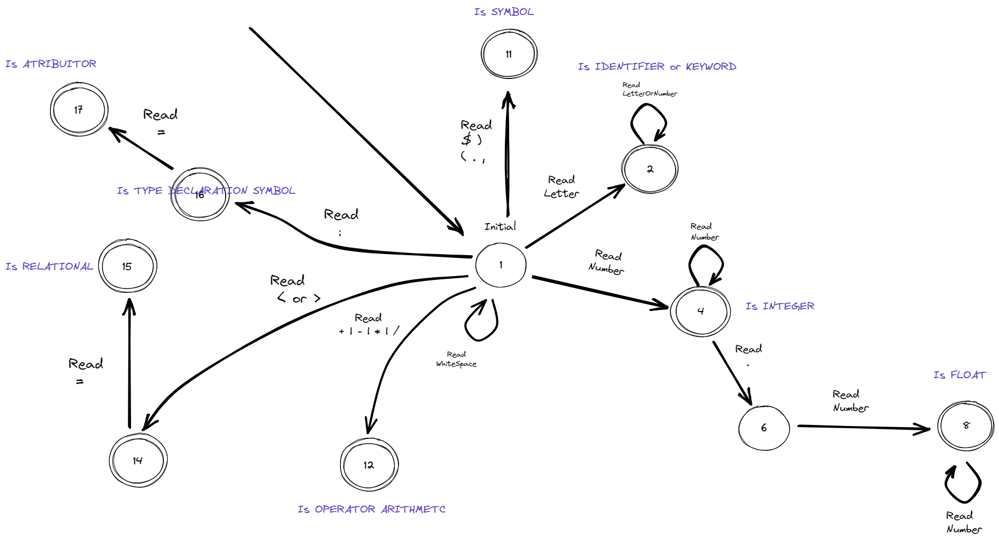

# Compiler

To run this project you will need a dotnet cli.

With dotnet cli installed, run the command on the root folder of the repository: 

``
dotnet run
``

### Lex Machine state:



### Syntactic:

```
<programa> -> program ident <corpo> .
<corpo> -> <dc> begin <comandos> end
<dc> -> <dc_v> <mais_dc>  |
        λ
<mais_dc> -> ; <dc> |
        λ
<dc_v> ->  <tipo_var> : <variaveis>
<tipo_var> -> real |
            integer
<variaveis> -> ident <mais_var>
<mais_var> -> , <variaveis> |
                λ
<comandos> -> <comando> <mais_comandos>
<mais_comandos> -> ; <comandos> |
                    λ
<comando> -> read (ident) |
            write (ident) |
            ident := <expressao> |
            if <condicao> then <comandos> <pfalsa> $
<condicao> -> <expressao> <relacao> <expressao>
<relacao> -> = |
            <> |
            >= |
            <= |
             > |
             <
<expressao> -> <termo> <outros_termos>
<termo> -> <op_un> <fator> <mais_fatores>
<op_un> -> - |
           λ
<fator> -> ident |
        numero_int |
        numero_real |
        (<expressao>)
<outros_termos> -> <op_ad> <termo> <outros_termos> |
        λ
<op_ad> -> + |
           -
<mais_fatores> -> <op_mul> <fator> <mais_fatores> |
                 λ
<pfalsa> -> else <comandos> |
                λ
<op_mul> -> * | 
            /

```

